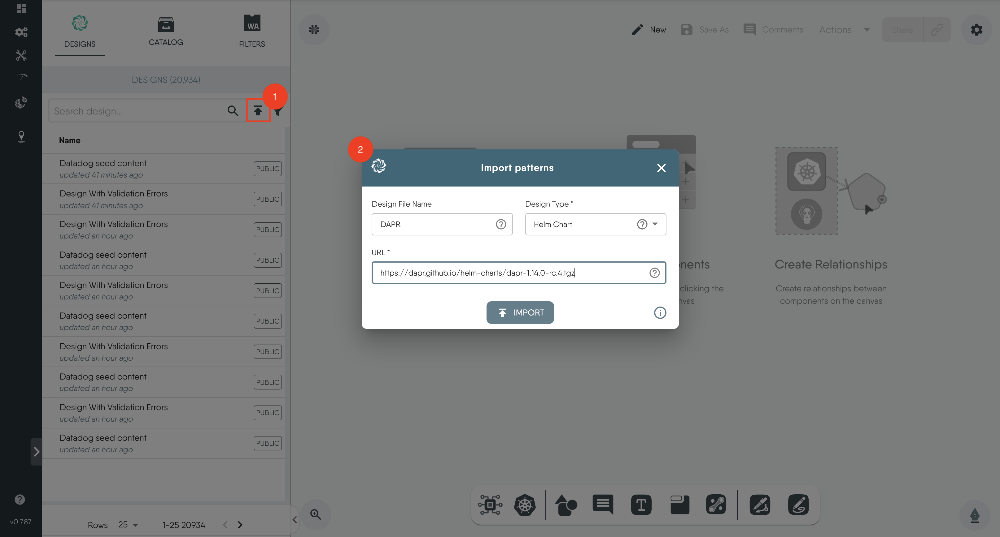
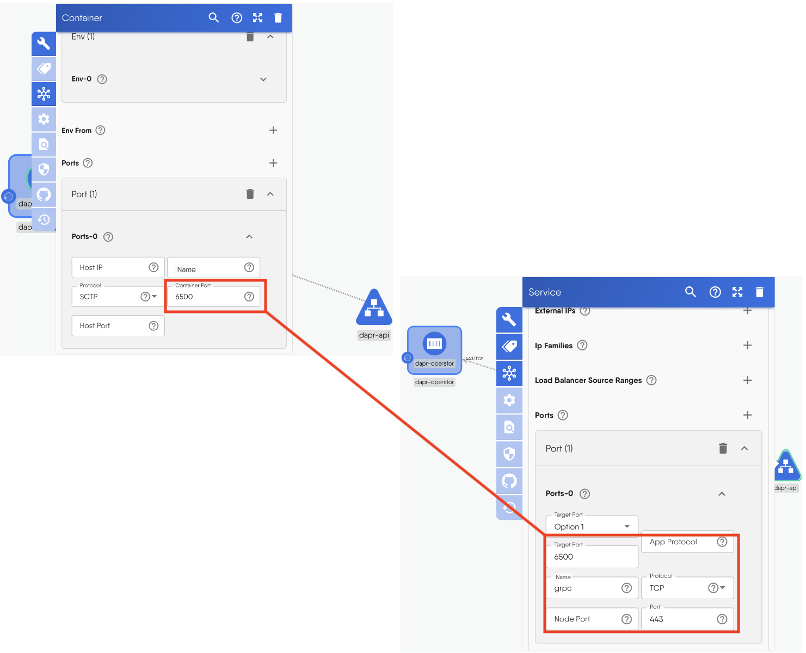
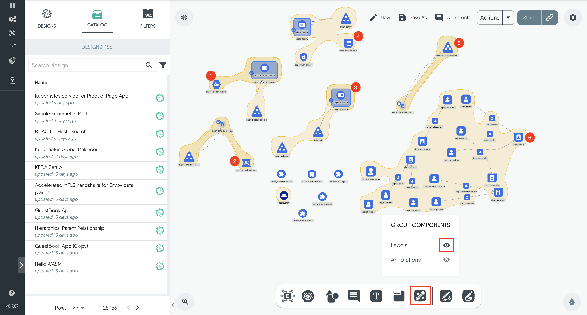
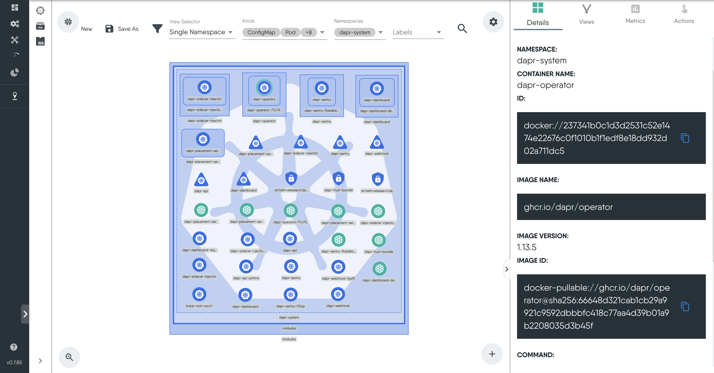

The [Dapr control plane](https://docs.dapr.io/concepts/dapr-services/) is a set of services responsible for managing and orchestrating the runtime and configuration of Dapr. The control plane ensures the smooth operation, deployment, and management of Dapr sidecars and their interactions within a microservices architecture.

### Steps

### Import Dapr Helm Chart

1. In the left sidebar, click the upward arrow symbol (import icon) to import the file into Meshery.
2. In the modal that appears:
   - Enter a name for your design in the **Design File Name** field (e.g. _DAPR_).
   - Select _Helm Chart_ from the **Design Type** dropdown menu.
   - Navigate to the [Dapr Helm Chart page](https://artifacthub.io/packages/helm/dapr/dapr/1.14.0-rc.4?modal=install) on Artifact Hub.
   - Right-click **this_link** at the bottom of the installation modal to copy the link address.
   - Paste the copied link in the **URL** field.
   - Then, click **Import**.

3. On the Designs tab on the left, click on the **DAPR** design you just imported. This will display the various Kubernetes resource components required for deploying the Dapr control plane on the canvas.



### Design Interpretation

From the design above, several key components that constitute the **Dapr control plane** can be observed, including:

-  **Dapr Sidecar Injector**: Automatically injects Dapr sidecars into the application pods.
-  **Dapr Operator**: Manages the lifecycle of Dapr components and configurations within the Kubernetes cluster.
-  **Dapr Placement Service**: Provides service discovery and routing for stateful applications, ensuring that stateful actors are placed correctly.
-  **Dapr Sentry**: Handles certificate authority and manages secure communication between Dapr instances.

Let’s take a closer look at some of the relationships between these components.

**Statefulsets, Deployments, and Services**



The triangles represent services, the rectangles represent deployments, and the cylinder icons represent statefulsets. Arrows indicate that a service is associated with a deployment/statefulset, exposing network access to it, indicative of an [Edge-Network](https://docs.meshery.io/concepts/logical/relationships#1-edge---network) relationship. The ports exposed by each service are shown at the ends of the arrows. To learn more about how to identify these components, see [Component Shape Guide]().

To briefly take a look at one of these network relationships, click on the dapr-operator container in the deployment and its service to open their configuration tabs.

From the diagram above, the container within the `dapr-operator` deployment is configured to expose Container port **6500**. The `dapr-api` service listens on port **443** and forwards incoming traffic to Target Port **6500**. This is why the arrow is labeled with **443/TCP**.

This illustrates how exposed ports are mapped to their corresponding services within a deployment configuration.

**Roles, ClusterRoles, and ServiceAccounts**



These resources represent Roles, ClusterRoles, ServiceAccounts, and other necessary RBAC configurations that the Dapr control plane requires within the cluster. An [Edge-permission](https://docs.meshery.io/concepts/logical/relationships#3-edge---permission) relationship exists between some of these components, which are bound through RoleBindings and ClusterRoleBindings.

**Custom Resource and Custom Resource Definitions**



Dapr leverages several Custom Resource Definitions (CRDs) to allow users manage and define its configuration and operation. The key custom resources are **Configurations**, **Components**, **Resiliency**, **Subscriptions**, **HTTPEndpoints**.

The **daprsystem** icon above is a custom resource of kind **Configuration**. It is used to configure global settings for Dapr components within a Kubernetes cluster.

The **Dapr State Store component** that manages Redis, as we mentioned before in the introduction, is a custom resource of kind **Component**. The Component CRD defines the configuration for external resources such as state stores, pub/sub brokers, and secret stores.

We can also explore relationships through grouped components.

**Grouped Components**

Click on the **Group Components** icon on the dock at the bottom of the canvas to group resources based on shared labels or annotations.

Using Meshery's grouping feature, we can organize related components, enhancing our understanding of the Dapr control plane within the Kubernetes environment. Let’s take a detailed look at the first group in the image above. It is the Dapr-sidecar-injector group consisting of these components:

1. Deployment
2. Service, and
3. Mutating Webhook Configuration

When a new application pod is deployed, the **dapr-sidecar-injector deployment** intercepts the pod creation request using the **Mutating Webhook Configuration** and programmatically attaches the Dapr sidecar to the pod based on configured annotations.

The grouping of these components illustrates their interconnections, enhancing our ability to visualize and understand how various parts function together within the cluster.

### Deploy Dapr

1. The Dapr control plane has to be deployed in the **dapr-system** namespace. Click on the namespaced components (deployments, services, etc.) to open up the configuration tab. Then change the namespace from **default** to **dapr-system**.
2. To deploy, click **Actions** in the top right corner and click on Deploy (double tick). To learn about deploying Designs in Meshery, see Chapter [Deploying Meshery Designs](https://cloud.layer5.io/academy/learning-paths/mastering-meshery/introduction-to-meshery).
3. After deployment, Click on **Open In Visualizer** to see the pre-filtered view of the deployed resources in the cluster.
4. In **Visualizer** mode, use the filter to adjust the views of the resources in the cluster.
   - For **View Selector** select **Single Node**.
   - For **Kinds** select the resources you want to see including _Deployments, Pods, Services, Statefulset, Secret, Replicaset, Endpoints and Endpoint slices_.

Using Meshery, we have visualized the components of the Dapr control plane, explored their relationships, and successfully deployed Dapr. Our next step is to integrate the Redis store into our architecture.
