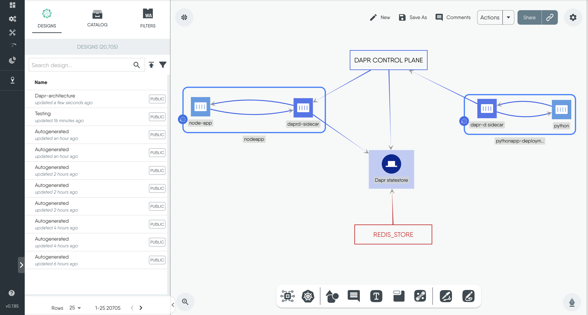

### Introduction

In this tutorial, you will explore how [Dapr](https://dapr.io/)(Distributed Application Runtime) operates within a Kubernetes cluster.

Using Meshery you will deploy the Dapr Helm chart along with sample applications: a Python application that generates messages and a Node.js application that consumes and stores those messages in a Redis state store, managed through Dapr's state store component model.

Meshery's Kanvas visualization capabilities allow you to examine the components involved in this architecture and understand their relationships. This breakdown helps you see how Dapr interacts with the applications, enhancing your comprehension of its functionality.

This tutorial expands on the [Hello Kubernetes tutorial with Dapr](https://github.com/dapr/quickstarts/tree/master/tutorials/hello-kubernetes), providing a visual approach to learning Dapr in a Kubernetes environment.

### Dapr Architecture

In a Dapr-enabled application, the sidecar architecture is central to how Dapr provides its functionalities. Each application pod in your Kubernetes cluster gets a Dapr sidecar injected, which acts as a proxy and mediator for service-to-service calls, state management, and other capabilities. This architecture allows Dapr to offer a set of APIs that simplify common microservice tasks such as **service invocation**, **state management**, and **pub/sub messaging**.

When one service needs to call another, the request is made to the local Dapr sidecar, which routes the request to the appropriate sidecar in the target service's pod. The target sidecar then forwards the request to its application.

Similarly, when your application makes a state management request (e.g., saving or retrieving state), it communicates with its local Dapr sidecar. The sidecar then uses the configuration retrieved from the Dapr control plane to interact with the configured state store.

This architecture ensures that your application remains loosely coupled and can leverage Dapr's capabilities without being tightly integrated with the infrastructure details.

The diagram below illustrates this setup, providing a visual representation of how Dapr components interact within the architecture. We will explore more on these concepts in subsequent chapters.

**Prerequisite**

1. Access to Meshery ([Self-Hosted](https://docs.meshery.io/installation) or [Meshery Playground](https://docs.meshery.io/installation/playground)).
1. Kubernetes Cluster connected to Meshery.


If you are using a self-hosted Meshery deployment, connect to your Kubernetes cluster using this [Guide](https://docs.meshery.io/installation/kubernetes). Alternatively, Meshery Playground users can use the live pre-registered Kubernetes connection. This tutorial uses a self-hosted Meshery deployment with a connected **Minikube** cluster.


### Learning Objectives

1. Gain hands-on experience in deploying Dapr on a Kubernetes cluster using Meshery.
1. Learn how to visualize these components using Meshery and get a better understanding of the Dapr architecture and interactions.
1. Understand how to use Dapr's state management capabilities to persist data in a Redis state store, and see how the Node.js app interacts with the state store to save and retrieve data.
