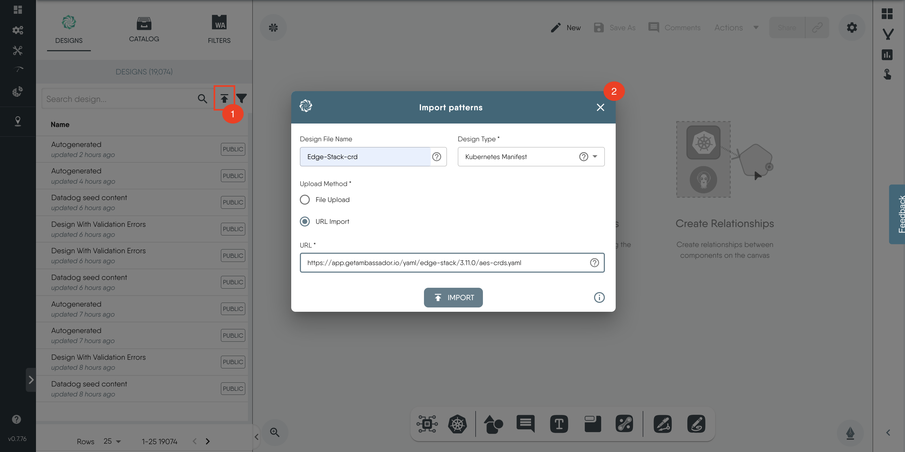
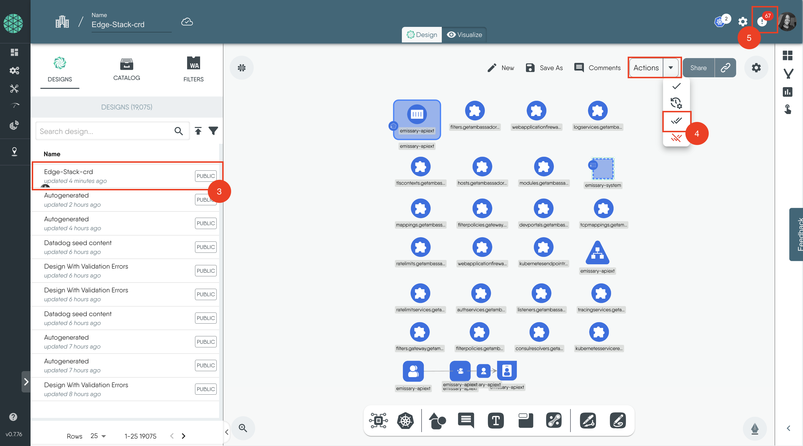
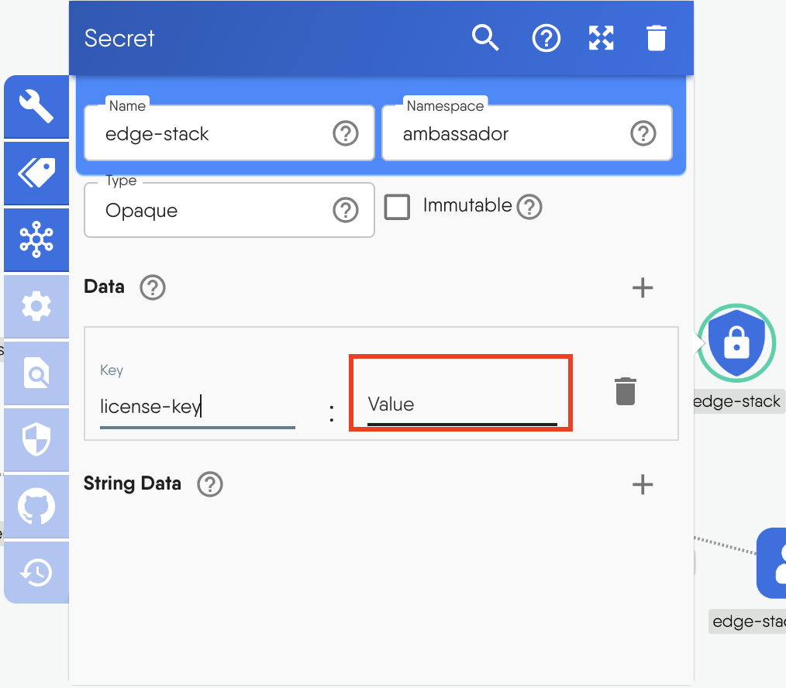
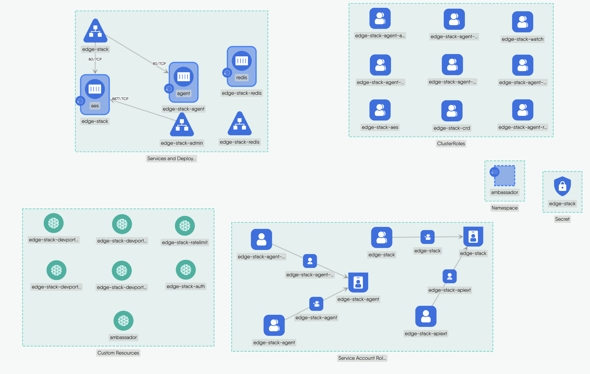
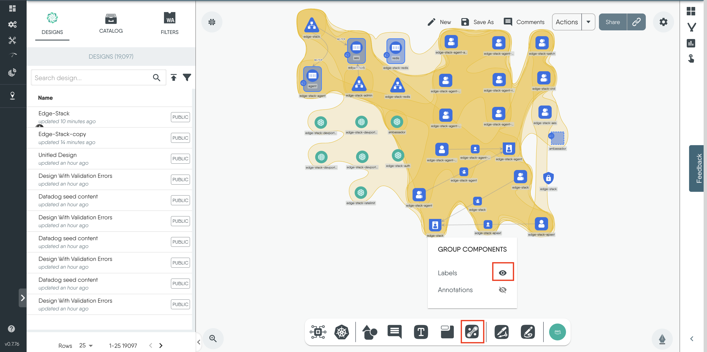
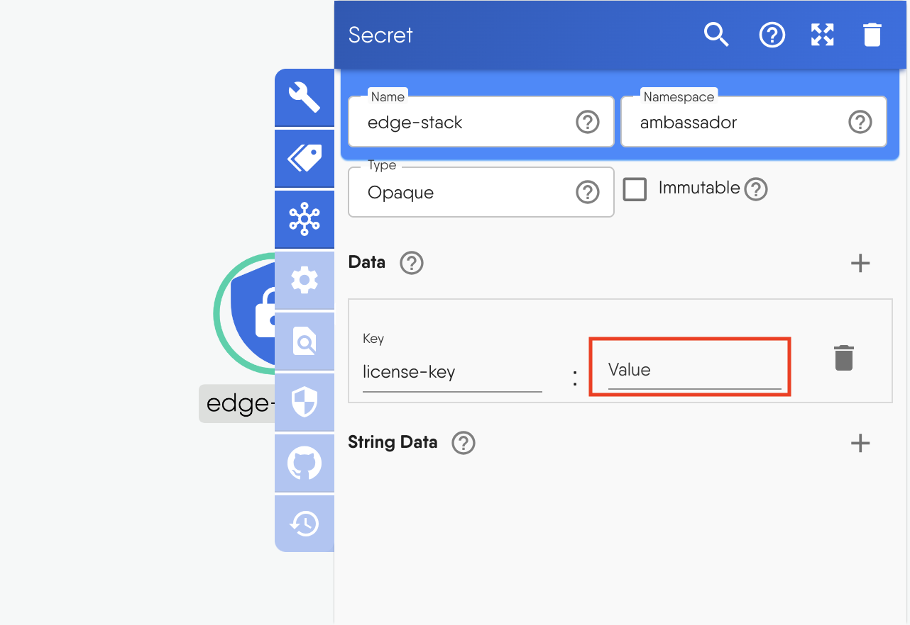
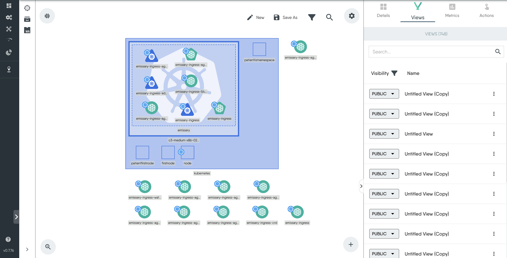

In this chapter, you will import and deploy Edge Stack Custom Resource Definitions (CRDs) and YAML files. You'll learn how to configure the necessary Ambassador Cloud license and set up essential components like Listener and Mapping resources. Finally, you'll deploy a sample Quote service application to route traffic through Edge Stack.

### Steps

### Import Edge Stack CRD YAML and Deploy

The Edge Stack CRD YAML file typically contains the definitions for custom resources used by Edge Stack. These definitions include the schemas and validation rules for resources like Mappings, Hosts, TLSContexts, RateLimits, Filters, and more. These custom resources allow you to define and manage the various aspects of your API gateway configuration, such as routing, authentication, rate limiting, and TLS settings, directly within your Kubernetes cluster.

1. In the left sidebar, click on the upward arrow symbol (import icon) to import the file into Meshery.

2. In the modal that appears:
   - Enter a name for your design in the **Design File Name** field (e.g. _Edge-stack-crd_).
   - Select _Kubernetes Manifest_ from the **Design Type** dropdown menu.
   - Choose **Url upload** for the upload method, and paste in the [Edge-Stack-crd](https://app.getambassador.io/yaml/edge-stack/3.11.0/aes-crds.yaml) YAML link.
   - Then, click on **Import**.



3. Click on the name of the design on the Designs tab to display the visual representations of the various Kubernetes resources and their relationships on the canvas.

4. Click **Actions** in the top right corner and click on Deploy (double tick).

5. To check the status of your deployment, click on the notification icon on the top right corner.



6. Click on **Open In visualizer** to navigate to the Visualize section and see a pre-filtered view of the deployed resources in the cluster.



### Import the Edge Stack YAML

Now that the CRDs have been deployed, go ahead to deploy the main Edge Stack Configuration.

1. Follow the previous Steps to Import the [Edge Stack YAML](https://app.getambassador.io/yaml/edge-stack/3.11.0/aes.yaml) into Kanvas with the name _Edge-Stack_.



2. You can use the **Group Components** icon on the dock below to group resources based on shared labels or annotations.



### Configure Edge Stack License

Ambassador Edge Stack requires a valid license to operate. Generate your [license token](https://app.getambassador.io/cloud/edge-stack/license/new) to establish a secure connection between Edge Stack and Ambassador Cloud.

1. Complete the steps on the Ambassador Cloud to generate your license token, then copy the token. Be sure to convert it into **base64** format. You can use an online tool for this conversion.

2. Click on the Secret component on the design canvas and input the token.



### Deploy Edge Stack

1. Click **Actions** in the top right corner and click on Deploy (double tick).

2. Click on **Open In visualizer** to navigate to the Visualize section and see a pre-filtered view of the deployed resources in the cluster.



### Listener Custom Resource

The Listener Custom Resource tells Ambassador Edge Stack what port to listen on.

1. Copy the following the YAML and save it to a file called _listener.yaml_ , then import it into Kanvas.

```yaml
---
apiVersion: getambassador.io/v3alpha1
kind: Listener
metadata:
  name: edge-stack-listener-8080
  namespace: ambassador
spec:
  port: 8080
  protocol: HTTP
  securityModel: XFP
  hostBinding:
    namespace:
      from: ALL
---
apiVersion: getambassador.io/v3alpha1
kind: Listener
metadata:
  name: edge-stack-listener-8443
  namespace: ambassador
spec:
  port: 8443
  protocol: HTTPS
  securityModel: XFP
  hostBinding:
    namespace:
      from: ALL
```

2. Deploy the resource on Kanvas.

### Mapping Resource

Create a Mapping configuration that instructs Edge Stack on how and where to route traffic. In the YAML file below, any request coming to the specified _hostname_ with the _prefix_ /backend/ will be directed to the _quote service_.

Copy the following the YAML and save it to a file called _mapping.yaml_ , then import it into Kanvas.

```yaml
apiVersion: getambassador.io/v3alpha1
kind: Mapping
metadata:
  name: quote-backend
spec:
  hostname: "*"
  prefix: /backend/
  service: quote
  docs:
    path: "/.ambassador-internal/openapi-docs"
```

### Deploy Quote Service

Next, import the [Quote Service YAML](https://app.getambassador.io/yaml/v2-docs/3.9.1/quickstart/qotm.yaml) and deploy it on Kanvas. This step will create the necessary deployment and service resources for the Quote service within your Kubernetes cluster, allowing you to see how Edge Stack manages and routes traffic to this backend service.



