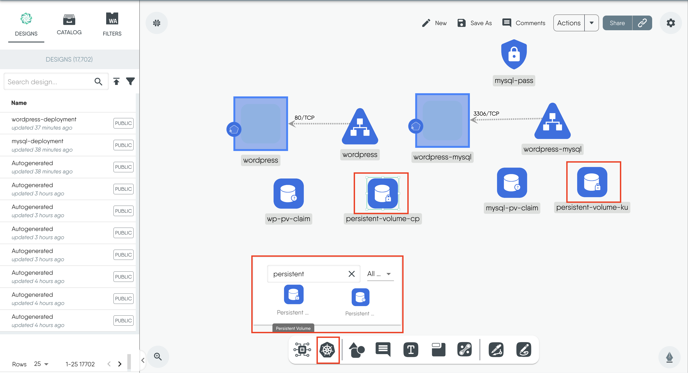
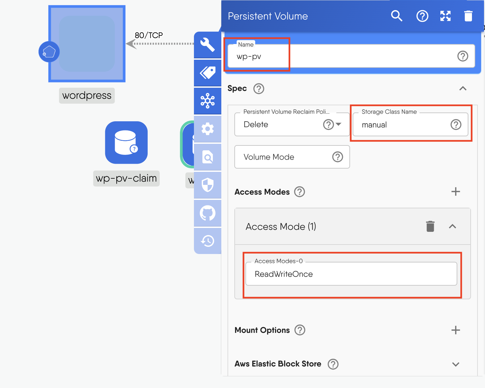
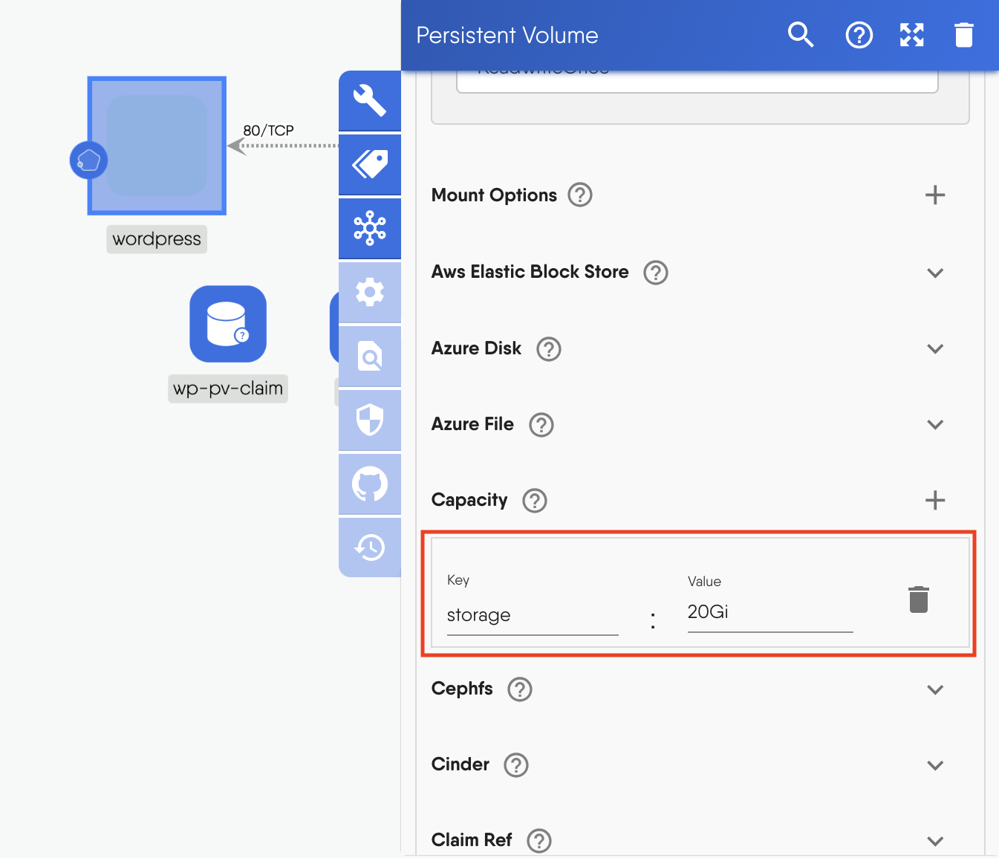
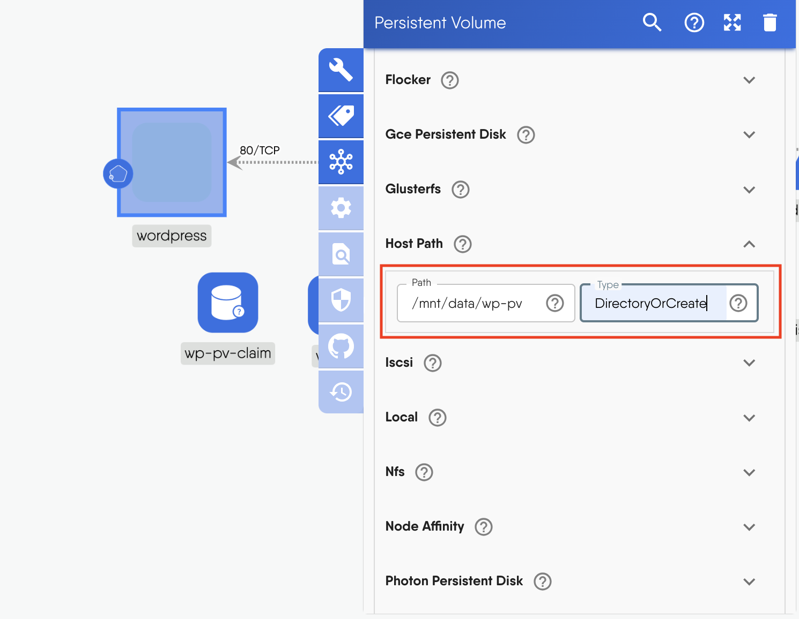

### Create and Configure Secret for MySQL Database

In this step, you create a Kubernetes secret component for the MySQL database. This is necessary because the configuration below is in the environment variables section of the mysql-deployment YAML file.

```yaml
env:
  - name: MYSQL_ROOT_PASSWORD
    valueFrom:
      secretKeyRef:
        name: mysql-pass
        key: password
```

Before you proceed, choose a password and convert it into base64 format. You can use an online tool for this conversion. For this example, the password is `password` and its base64 encoding is `cGFzc3dvcmQ=`.

1. Click on the Kubernetes icon on the dock, search for `secret`, and click on it or drag it to the canvas.


_Figure: Create secret component_

2. Click on the Secret component to open the configuration window.

   - Set the _name_ as `mysql-pass`
   - Set the _Type_ as `Opaque`
   - Click **+** next to Data and add the secret as a key-value pair `password:cGFzc3dvcmQ=`


_Figure: Configure secret_

3. Click outside the window to close the configuration tab.

### Create Persistent Volumes

MySQL and WordPress each require a [Persistent Volume (PV)](https://kubernetes.io/docs/concepts/storage/persistent-volumes/) to store their data.

For this tutorial, you will use the `manual` StorageClassName and set the Persistent Volume to use the `hostPath` type.

Please note that using `hostPath` for Persistent Volumes is generally not recommended for production environments because it ties the volume to the node's filesystem, which can lead to data loss if the node fails. However, you can use it in this tutorial for development purposes.

1. Click on the Kubernetes icon on the dock, search for `Persistent Volume`, and select it. Create two PVs.



_Figure: Create persistent volume_

2. Click on the wordpress PV to open the configuration window.

   - Change the "name" to `wp-pv`
   - Set the "StorageClassName" as `manual`
   - Click **+** next to "AccessMode" and enter `ReadWriteOnce`



_Figure: Configure persistent volume_

    - Scroll down to "Capacity" and enter the key pair `storage:20Gi`



_Figure: Persistent volume capacity_

    - Scroll down to "Hostpath" and input `mnt/data/wp-pv` for the _path_ and `DirectoryOrCreate` for the _type_.



_Figure: Persistent volume hostpath_

3. Repeat similar steps for the MySQL Persistent Volume

   - Click on the MySQL PV to open the configuration window.
   - Change the "name" to `mysql-pv`
   - Set the "StorageClassName" to `manual`
   - Click **+** next to "AccessMode" and set it to `ReadWriteOnce`
   - Scroll down to "Capacity" and enter the key pair `storage:20Gi`
   - Scroll down to "Hostpath" and input `mnt/data/mysql-pv` for the _path_ and `DirectoryOrCreate` for the _type_.

4. Click on `wp-pv-claim` and `mysql-pv-claim` and set their "StorageClassName" as `manual`.

