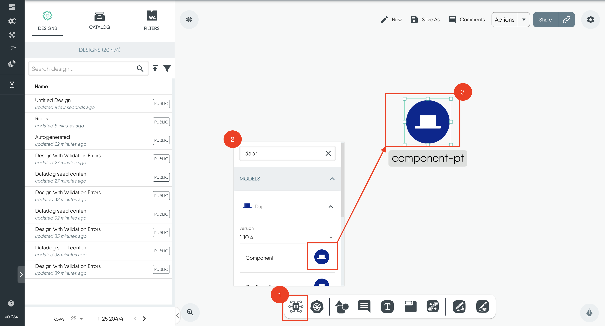
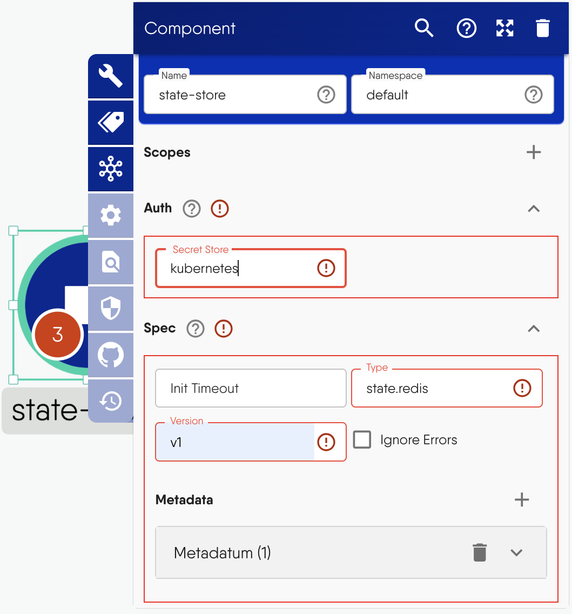
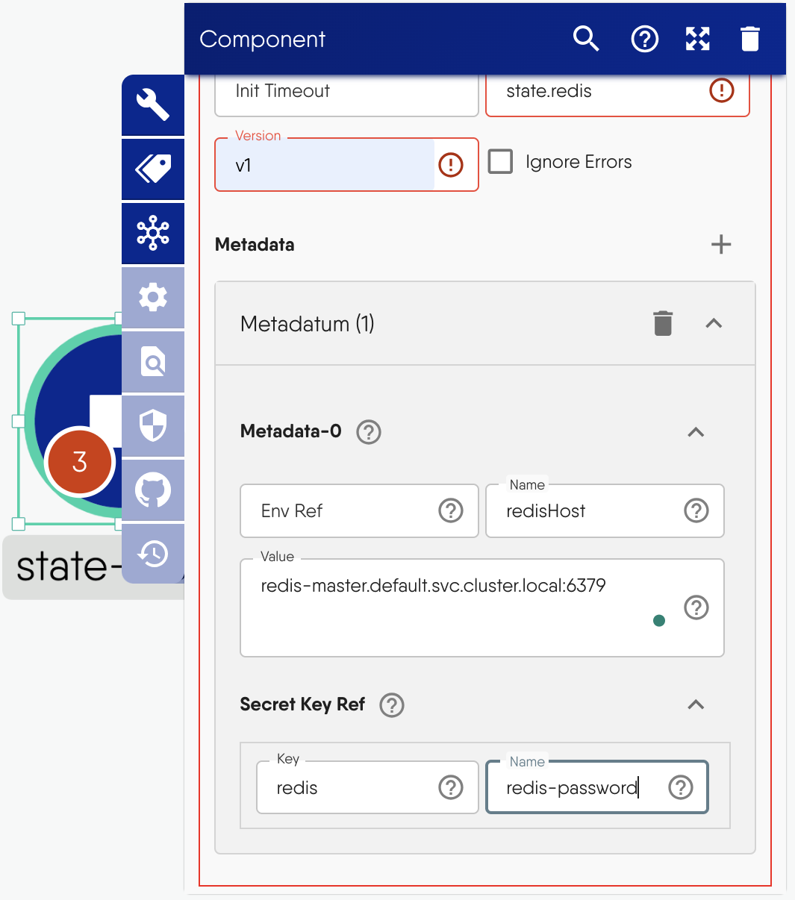

### Create, Configure and Deploy Dapr Redis State Store Component

Following the deployment of the Redis state store, we will use Meshery to create and configure the Dapr state store component. This involves specifying essential details, including the redisHost and redisPassword fields in the Dapr component configuration, which tell Dapr where to find the Redis server and how to authenticate.

This setup ensures that Dapr connects to the correct Redis instance, allowing it to handle state management seamlessly without direct involvement from your application.

#### Search for Component

1. On the Dock at the bottom of the design canvas, click on **Components**.
2. Search for "dapr".
3. Click on the drop-down and drag and drop **component** to the design canvas. This is the Dapr component custom resource we discussed when learning about the Dapr control plane.

#### Configure State Store and Deploy

Now you can start configuring the Dapr state-store.

1. Click on the component to open the configuration tab.
2. Enter _state-store_ as the **name**.
3. Enter _kubernetes_ in the **Secret store** field.
4. Enter _state.redis_ in the **Type** field.
5. Enter _v1_ in the **version** field.



6. Click on the **metadata** drop-down and begin to fill in the info.
   - For **Name**, enter _redisHost_.
   - For **Value**, enter _redis-master.default.svc.cluster.local:6379_.
   - Under **Secret Key Ref**, enter the pair _redis:redis-password_.

7. Click the **Actions** button and deploy.

Next we will deploy the Python and Node.js applications.

