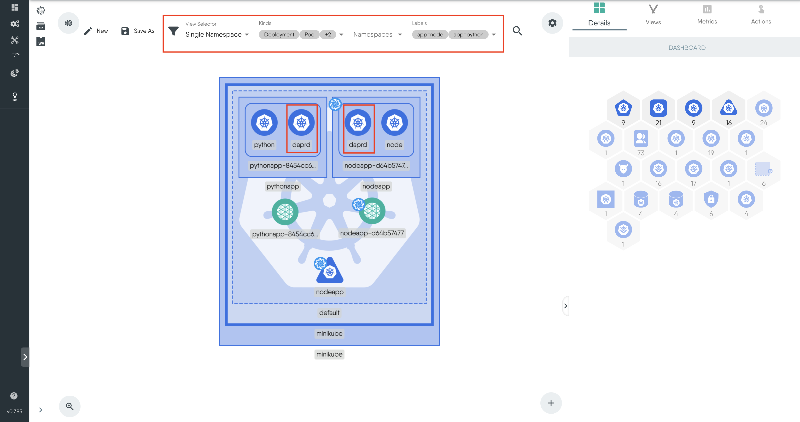

### Deploy Node.js Application

1. Clone [this](https://github.com/dapr/quickstarts.git) repo and cd into **quickstarts/tutorials/hello-kubernetes/deploy** directory to get the Node.js and Python YAML files.
2. Import the Node.js application into Meshery.



The Dapr annotations in the manifest file will let the Dapr sidecar injector know that it is supposed to inject a sidecar container into this pod during creation.

```yaml
annotations:
        dapr.io/enabled: "true"
        dapr.io/app-id: "nodeapp"
        dapr.io/app-port: "3000"
        dapr.io/enable-api-logging: "true"
```

3. Click the **Actions** button and deploy.

### Deploy Python Application

Follow previous steps to import and Deploy the python application.



Switch to visualizer and filter according to these specifications:

- For **View Selector** select **Single Namespace**.
- For **Kinds** select the resources you want to see including _Deployments, Pods, Services, Replicaset_.
- For **Labels** select _app=node_ and _app=python_.

You should see the daprd sidecar containers in both the python and node pods.


