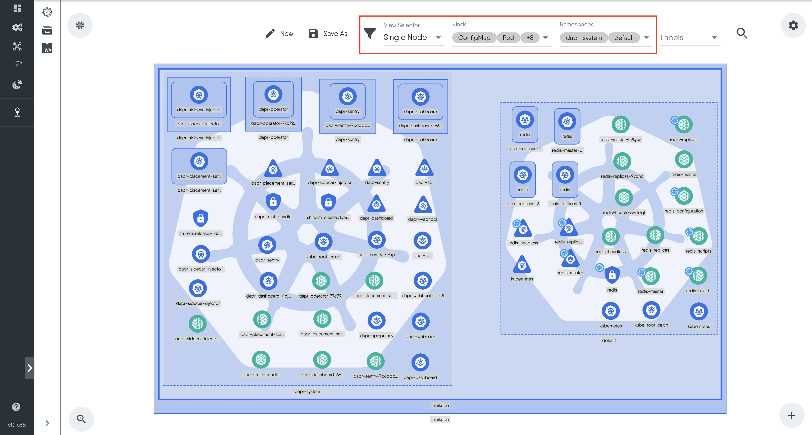

### Import Redis Helm Chart and Deploy to Cluster

1. Follow the same steps used for the Dapr deployment to import this [Redis helm chart](https://charts.bitnami.com/bitnami/redis-19.6.2.tgz) into Meshery and deploy.



2. Click **Actions** to deploy, then click **Open In Visualizer**.
3. In **Visualizer** mode, use the filter to adjust the views of the resources in the cluster.
   - For **View Selector** select **Single Node**.
   - For **Kinds** select the resources you want to see including _Deployments, Pods, Services, Statefulset, Secret, Replicaset, Endpoints and Endpoint slices_.
   - For **Namespaces** select _dapr_system_ and _default_.

These filter settings will allow you to view both Dapr resources within the _dapr-system_ namespace and Redis resources within the default namespace.

Next, let's deploy the Dapr state store component that will manage this Redis state store.
