## Introduction

Configuring Meshery is foundational to effectively managing and deploying your infrastructure. By understanding what `Teams`, `Workspaces`,`Connections` and `Environments` are and how to set them up, you can effectively manage and monitor your cloud-native infrastructure, as well as collaborate with your team by sharing and organizing your resources.

**Prerequisite**

1. Access to Meshery ([Self-Hosted](https://docs.meshery.io/installation) or [Meshery Playground](https://docs.meshery.io/installation/playground)).

To start configuring Meshery:

1. Navigate to the left sidebar of Meshery.
1. Click on the **Lifecycle** dropdown and you will see all the menu items we need in this chapter.

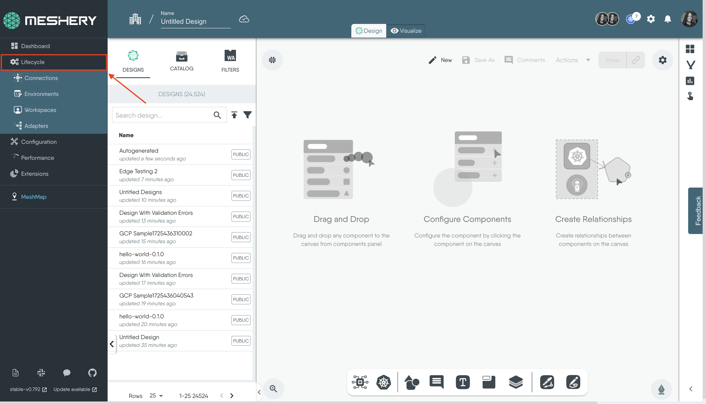
## Creating Teams

Creating a [Team](https://docs.layer5.io/cloud/identity/teams/) is the first step in configuring Meshery. In Meshery, a team is a user group that manages and shares access to resources such as Workspaces, Designs, and Environments. Teams enable efficient collaboration and permission management, facilitating organized operations within an organization. Teams offer control access to workspaces and to workspace resources such as Environments and Connections.

Follow the steps below to create a team:

1. Teams are visible when you visit the [**Identity**](https://cloud.layer5.io/identity/teams) page in Layer5 Cloud.
1. Select **Add Team**, enter a name for your team, add Team Members, and **Create Team**.

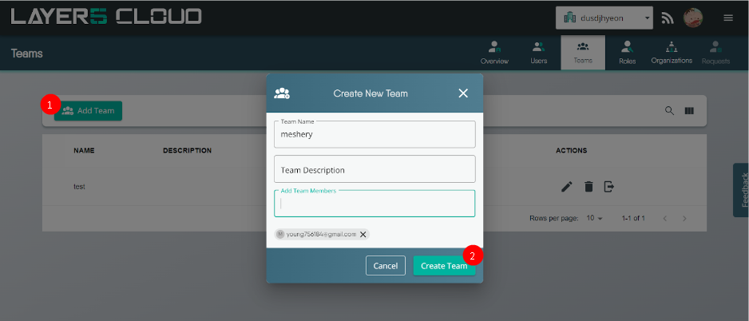

## Creating Workspaces

Creating a [Workspace](https://docs.layer5.io/cloud/spaces/workspaces/) is an important step in configuring Meshery. A workspace in Meshery is a logical grouping of resources that helps organize and manage your infrastructure more effectively. It is used to separate different projects or environments within your team, enabling better collaboration and resource management. Every user is assigned a default workspace, which can be customized as needed.

To create a workspace:

1. Navigate to **Workspaces** under the **Lifecycle** dropdown.
1. Click **Create**.
1. Enter a name for your workspace and **Save**.

1. Once saved, the new Workspace will be created and displayed on the screen.

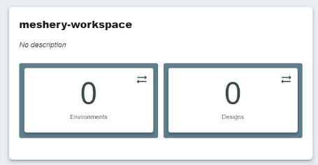
In the subsequent sections, we will discuss `Environments` and `Designs` shown in the image above.

## Creating Environments and Associating Connections

[Environments](https://docs.layer5.io/cloud/spaces/environments/) and [Connections](https://docs.meshery.io/concepts/logical/connections) are essential for efficient resource management in Workspaces. Environments logically group related Connections and Credentials, simplifying management and sharing. Connections within Environments become immediately available for use in any assigned Workspaces.

### Creating an Environment

To create an environment:

1. Navigate to **Environments** under the **Lifecycle** dropdown.
1. Click **Create**.
1. Enter the name of the environment and **Save**.

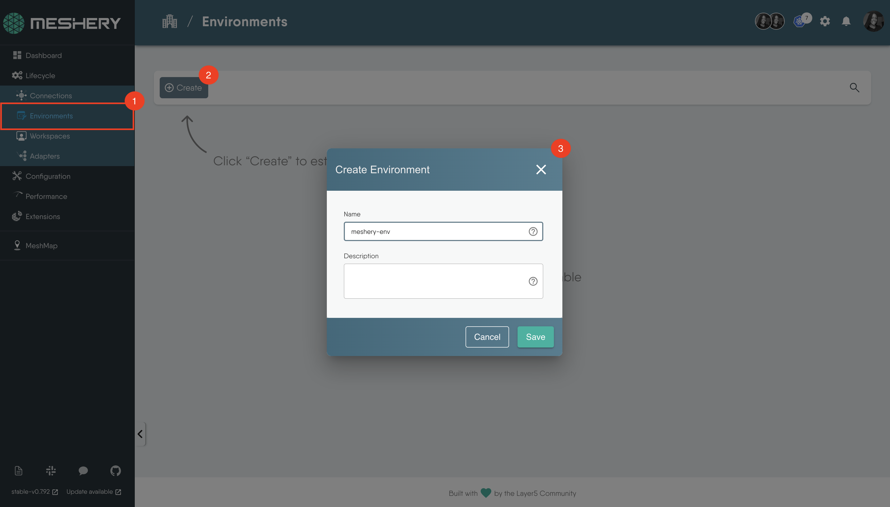

1. Once saved, the new Environment will be created and displayed on the screen.

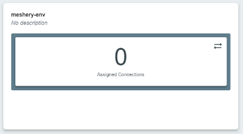

Next We'll learn how to assign Connections to Environments.

### Associating Connections with an Environment

Examples of connections managed by Meshery include GitHub integrations, Prometheus connections, Kubernetes clusters, and more. It's essential to assign these connections to an environment and link that environment to your selected workspace.

To add a connection to an environment:

1. Click on the **arrows** icon, and a modal displaying your available connections will appear.

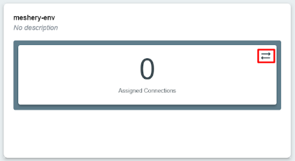

1. **Available Connections** shows a list of Kubernetes clusters that are currently managed by Meshery.
1. Select the connection(s) you want to assign.
1. Use the appropriate arrow icons to manage your selections:
      * The first arrow assigns all connections.
      * The second arrow assigns only the selected connections.
      * The third arrow removes the selected connection.
      * The fourth arrow removes all connections.
1. Click **Save** to confirm your changes.

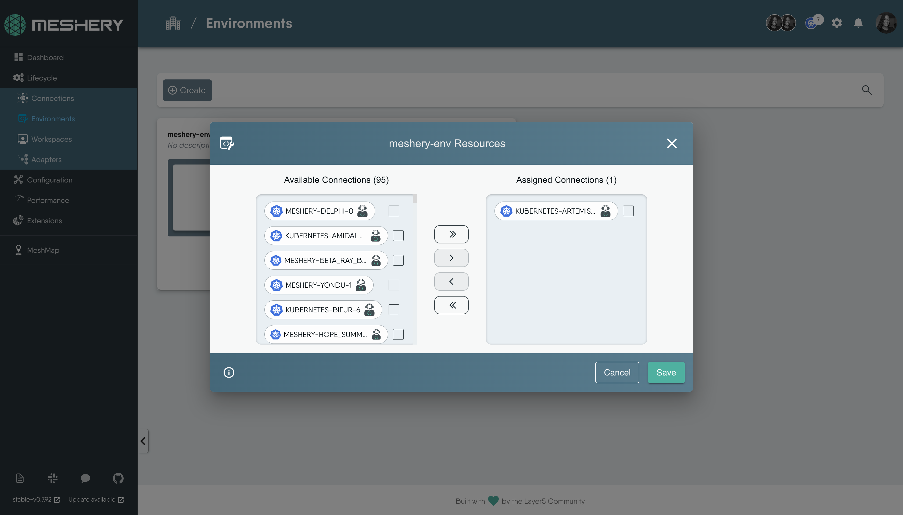

1. The Connections have now been assigned to the Environment.

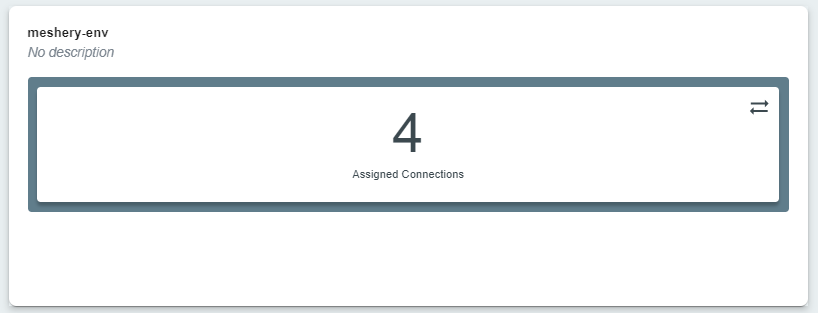

### Navigating the Connections Page

The `Connections` page serves as a central hub for managing the clusters you are connected to. This page provides valuable information and functionality to help you understand and interact with all your connections.

To access the Connections page, click on **Connections** under the **Lifecycle** dropdown.

#### Adding Cluster Connection

On the Connections page, you can easily add a Kubernetes cluster connection. To do this:

1. Click the **Add Cluster** button to get started.

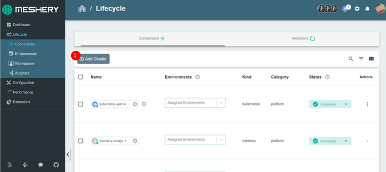

1. When the modal appears, navigate to the location of your kubeconfig file and upload it to add your cluster as a connection.

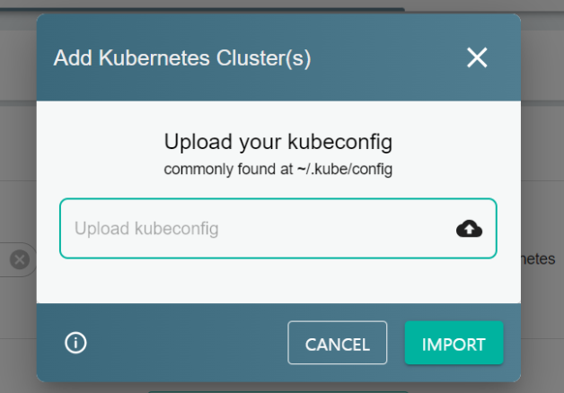

1. After uploading the kubeconfig file, the modal should indicate that your cluster has been successfully added as a connection.

    If you uploaded an invalid kubeconfig file, you might see an error message statement like the one below. Please ensure you are uploading the correct file with the proper configuration and try again.

#### Viewing Cluster Connection Details

Each connection has key details associated with it such as:

1. **Environment**: This displays the environments associated with the connection. Click on the drop-down to add your connection to your Environment and see which Environments the connection is linked to.
2. **Status**: Indicates the currently assigned state and information about what state the connection may or may not transition to. You can learn about [Connection Status](https://docs.meshery.io/concepts/logical/connections#states-and-the-lifecycle-of-connections)
3. If [MeshSync](https://docs.meshery.io/concepts/architecture/meshsync) is actively running in your cluster, clicking the "Flush MeshSync" button will update MeshSync with the latest data, ensuring it matches the current state of your cluster.
This ensures that MeshSync's data is refreshed and accurately reflects the current state of your cluster's infrastructure and resources.

## Integrating Workspaces with Environments and Designs

You can assign your created Environments to Workspaces, enabling effective collaboration and resource utilization across your team. This feature allows you to organize your Environments based on specific projects, teams, or use cases, making it easier to manage and share resources within your organization.

Integrating designs with Workspaces enables effective collaboration and sharing of infrastructure configurations across your team. When you assign an Environment containing your designs to a Workspace, team members with access to that Workspace can view, manage, and build upon the shared designs and share feedback.

### Assigning Environments and Designs to Workspaces

1. Navigate to **Workspaces** under **Lifecycle**.
1. In the image below, there are two **arrows** for associating `Environments` and `Designs` to Workspaces, respectively.

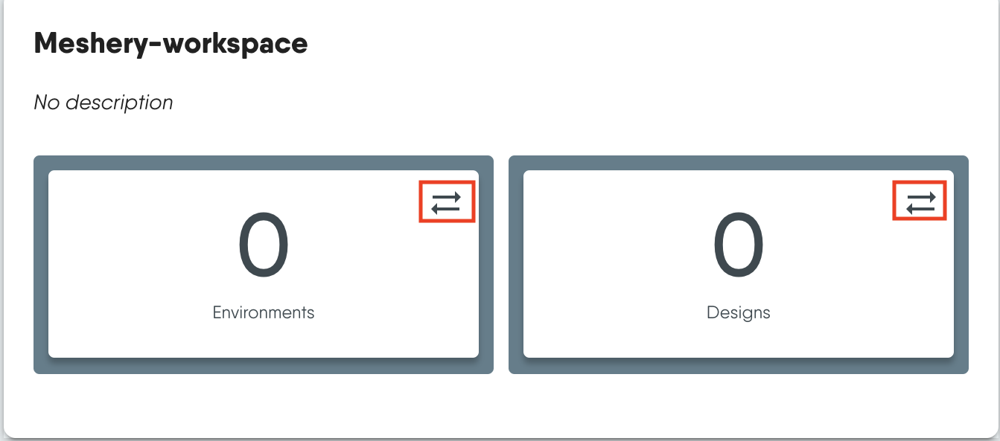

1. Click the appropriate arrow to assign the selected Environments(or Designs) and **Save**.

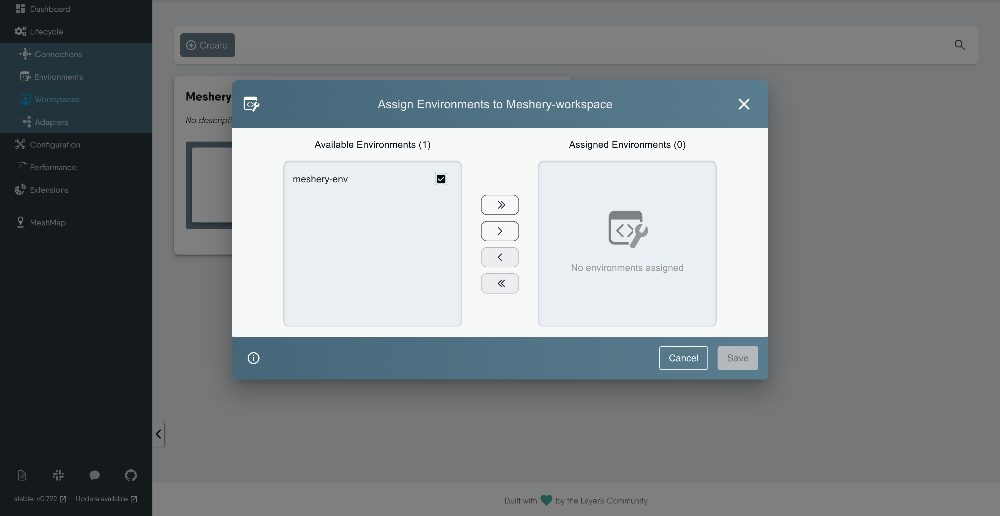

#### Confirm Workspace Association

Now, the environment and design are associated with the workspace. You get standardized resource deployment and cross-team collaboration. This enables efficient resource management and tracking, and makes team members more productive.

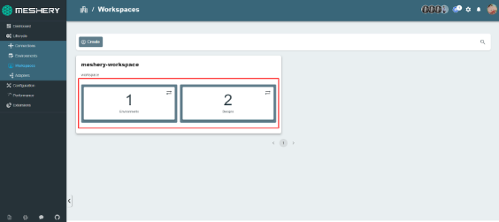

## Conclusion

In this chapter, you learned how to effectively configure Meshery, laying the groundwork for managing your infrastructure and optimizing workload within Kubernetes environments. Starting with the creation of workspaces, you established collaborative environments where teams can organize and deploy resources efficiently.

You explored the setup of environments, which serve as logical groupings for managing Kubernetes connections and other resources. By adding cluster connections and associating them with environments, you ensured seamless integration and management of your infrastructure components.

Throughout the configuration process, you encountered various steps to integrate workspaces with environments and designs. This integration not only streamlined resource management but also facilitated standardized deployments across Kubernetes clusters associated with your workspace.

