## Introduction

Creating designs in Kanvas is a seamless process that enables you to visualize, configure, and manage cloud-native infrastructure efficiently. This chapter will guide you through various methods of creating designs, whether starting from scratch, importing configuration files like Helm charts or Kubernetes manifests, or utilizing published designs from the Layer5 Cloud catalog.

## Accessing Designer Mode

1. Log in to [Meshery Playground](https://cloud.layer5.io/). After successfully logging in, you'll land on the dashboard.

2. In the Cloud Native Playground tile, click **Explore** to navigate to Kanvas.

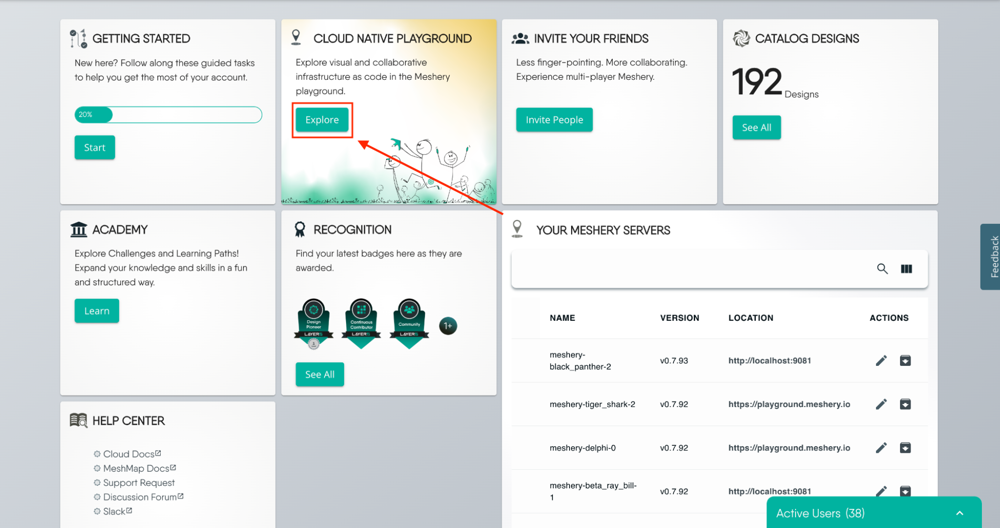

3. On the left sidebar, click the Kanvas icon to open Kanvas in Designer mode.

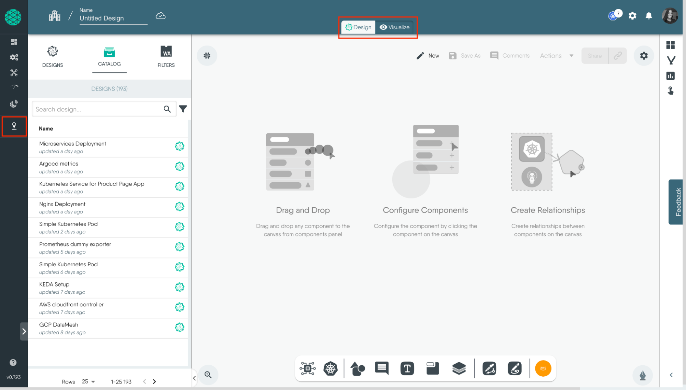

## Starting from Scratch

Think of Designer mode as your blueprint studio. Just like architects use specific tools to design buildings, you use Kanvas to design your cloud-native applications.

**Step 1: Create And Name Your Design**

1. Click **New** at the top right of the screen to open a new design canvas.

2. Give your design a meaningful name, reflecting its purpose or key components. 

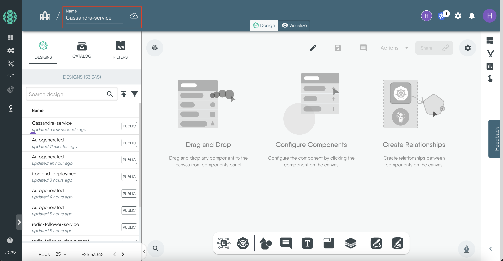

**Step 2: Browsing Available Components**

Explore the extensive Dock in **Designer** mode, which offers a wide range of Kubernetes and other integration components.

Think of the Dock as a palette of building blocks for your cloud-native app. Just like selecting different materials for a construction project, you choose components for your app’s architecture.

Components can be found in the **Dock** at the bottom of the design canvas.

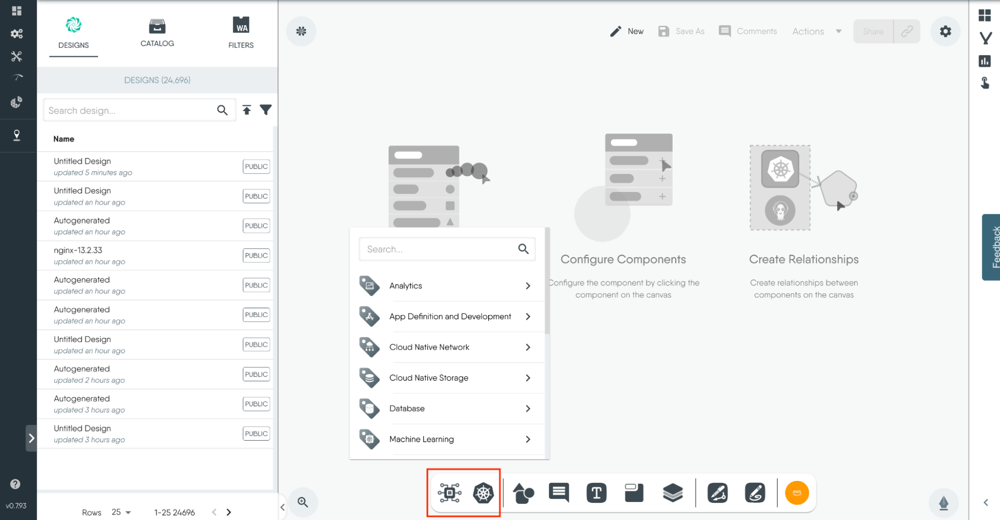

**Step 3: Selecting Specific Versions**

To ensure precision in your design, select the specific version of each component you need. Kanvas supports a variety of versions for different components, allowing you to tailor your design to meet your exact requirements. A compatibility check is conducted, ensuring that selected versions align seamlessly within your design.

Choosing component versions is similar to selecting software versions for your cloud-native app. It’s like picking the right versions of libraries to ensure your app functions smoothly.

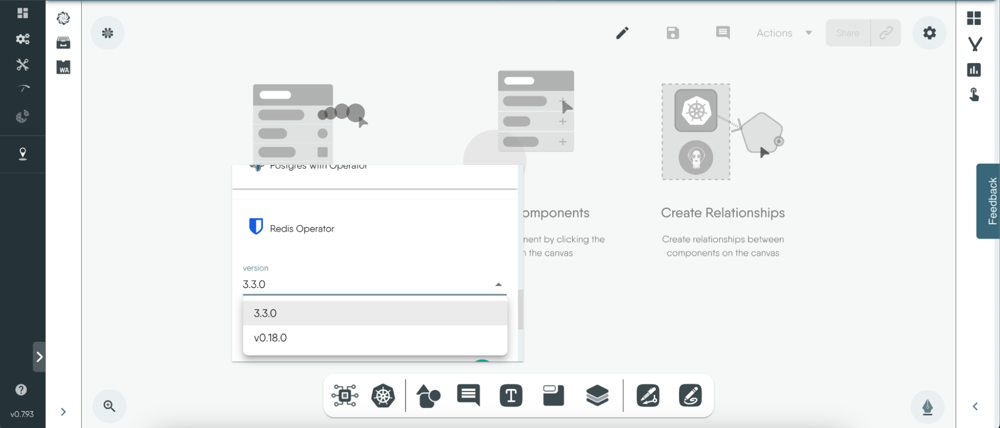

**Step 4: Building Complex Cloud Native Deployments**

With the Designer toolbox at your disposal, effortlessly construct complex cloud-native deployments. Simply drag and drop components onto the Kanvas canvas, arranging and configuring them in a way that suits your architecture.

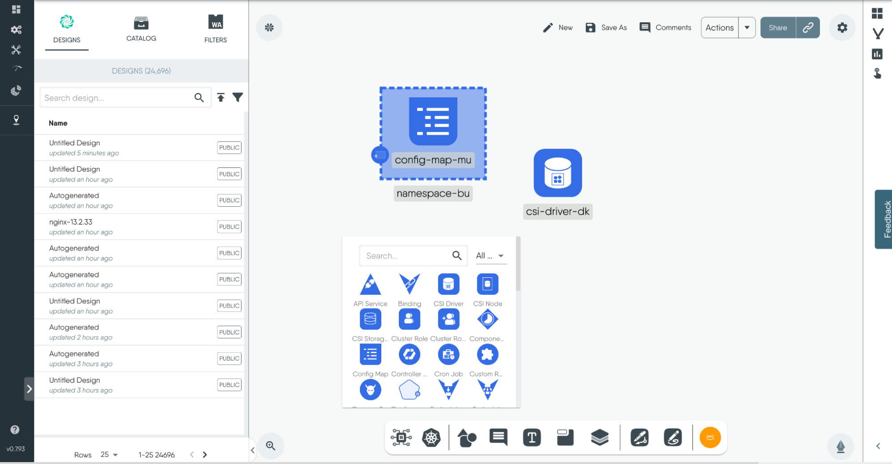

**Step 5: Configuring Each Component**

Configure your design by adjusting each component through the **Configuration** tab. Click on the component to open up its Configuration tab. Kanvas's intuitive interface allows you to enter settings and parameters directly on the design canvas. As you modify these configurations, your design updates in real-time. Kanvas's auto-sync feature ensures that configuration changes are instantly reflected in the design.

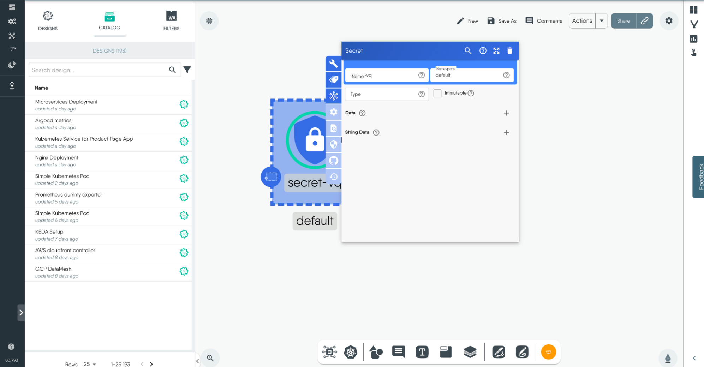

**Step 6: Design Actions and Interactions**

Explore additional design actions by right-clicking on components. Group components together or establish connections between them according to your needs. Kanvas responds in real-time to design actions, providing a fluid and responsive user experience.

## Starting from existing infrastructure files

When working with Kanvas, you can effortlessly integrate various design files to start building and managing your cloud-native applications. Whether you’re working with Helm charts, Docker Compose files, or  Kubernetes manifests, Kanvas provides a unified interface to import these files and visualize your infrastructure setup. This versatility allows you to streamline the design process, ensure consistency, and tailor your cloud-native environments to meet specific needs.

**Importing a Design**

1. Click the **Import design** option under the **Designs** tab in Kanvas.

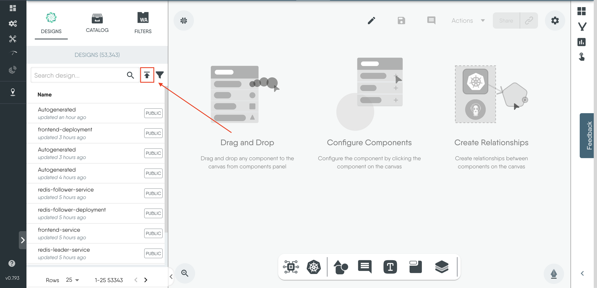

2. Enter a name for the design in the **Design File Name** field.

3. Choose the appropriate **Design Type** for the file you want to import (Helm Chart, Kubernetes, Manifest, etc).

4. Select your preferred import method: either **URL** or **File Upload**.

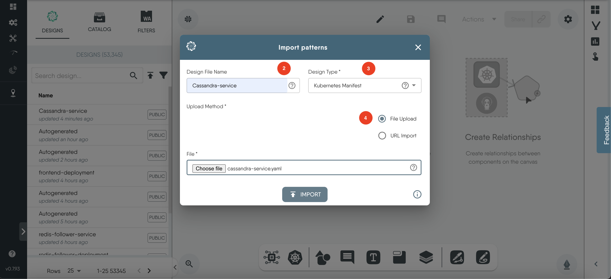

5. **Example:** Use the Meshery Server Helm chart at [Meshery Helm Chart](https://meshery.github.io/meshery.io/charts/meshery-v0.7.48.tgz).

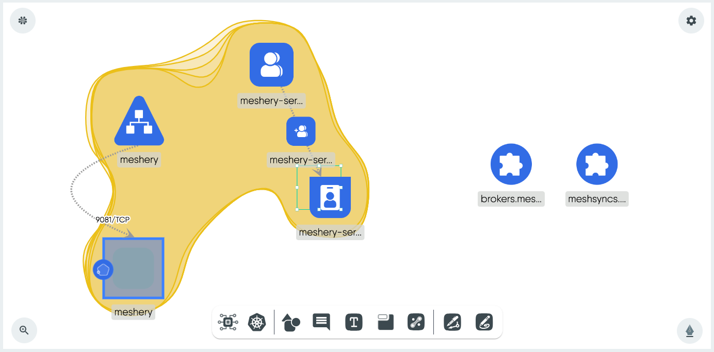

6. **Review and Modify:** You should now have a Kanvas design of the chart. Continue to make any changes if required or deploy it.

## Cloning a Design

**Steps to Clone a Design from Catalog using Kanvas:**

1. Switch to Kanvas Designer mode, if not already in it. 

2. In the left navigation panel, click the **“Catalog”** menu tab.

3. Select a design from the list that appears in the panel.

4. A modal will pop up requesting you to clone (create a copy of) the design you’ve selected.

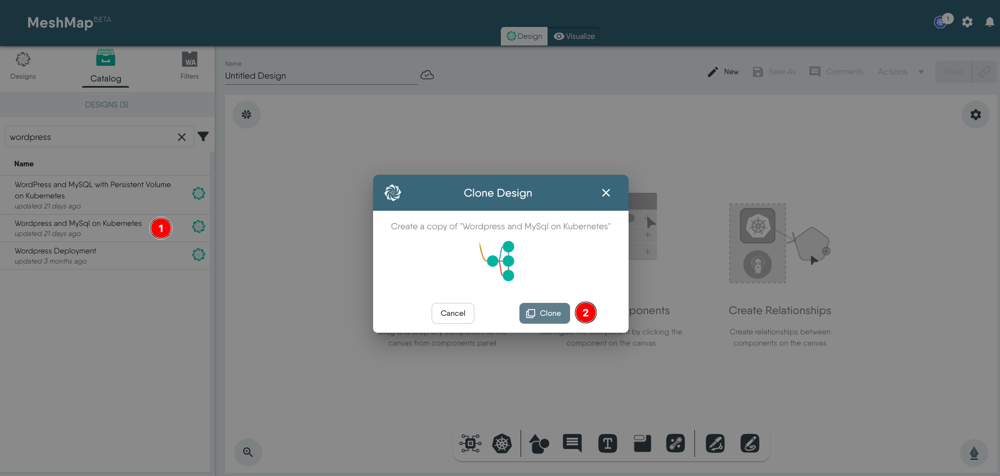

5. Click **“clone”** and a copy of the design will appear on your Kanvas canvas. You can then configure the design to suit your purposes.

6. Find your newly cloned design in the list of designs in the left navigation panel.

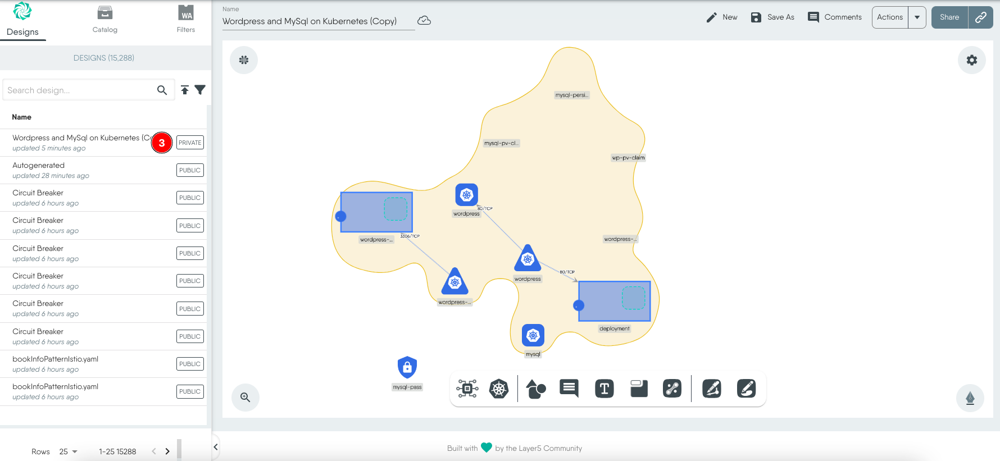

## Github Integrations

Integrating your GitHub account with Meshery unlocks the ability to import files as designs directly from your repositories, enhancing your collaboration and version control processes. This integration allows you to streamline your workflow, ensuring that your design infrastructure is always up-to-date and aligned with your source code. To get started with integrating GitHub into Meshery, follow the comprehensive guide available [here](https://docs.layer5.io/cloud/getting-started/github-integration/).

After importing your designs, they will appear in the [catalog](https://cloud.layer5.io/catalog).

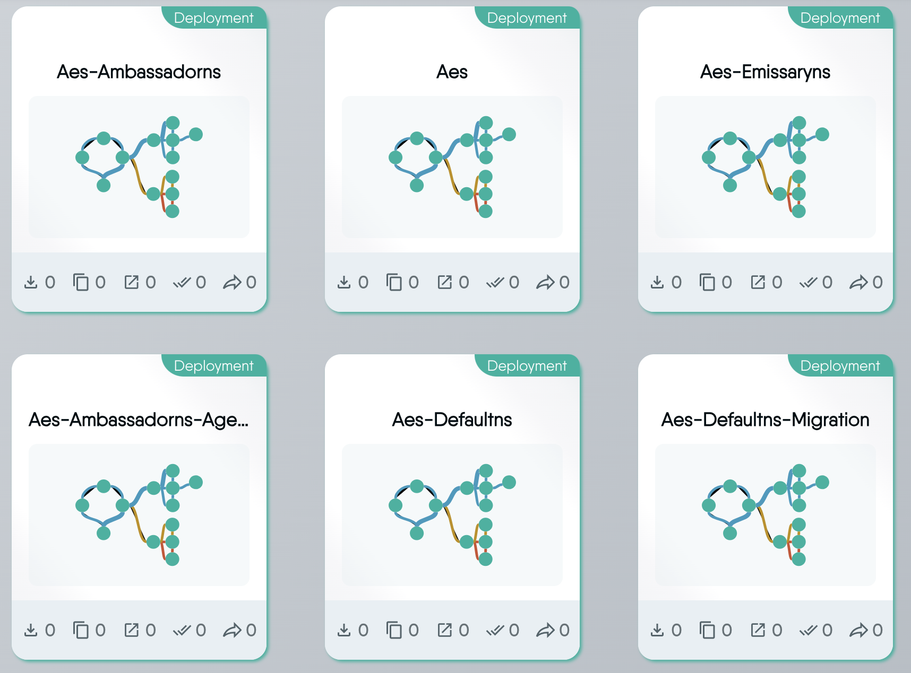

To view the design on the canvas:

1. Click on the Catalog Card. 

2. Click on **Open in Playground**. This will display the design on the canvas.

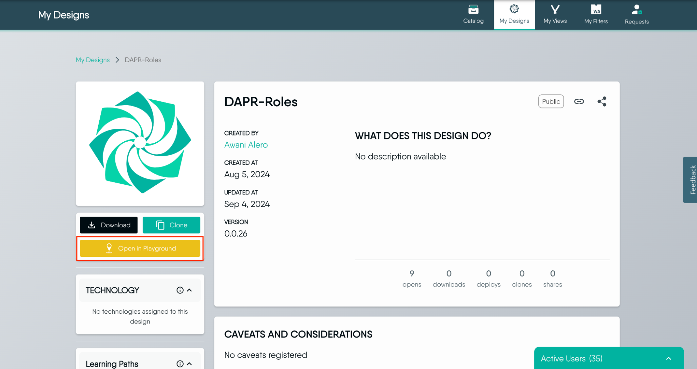

## Merging Designs

For enhanced collaboration and scalability, merge existing designs into your canvas by dragging and dropping. This feature enables you to consolidate multiple designs, creating a unified and comprehensive view of your infrastructure. 

Kanvas orchestrates the merging process internally, creating a unified design that incorporates components from the dragged designs. Importantly, users do not lose their original designs during the merging process. Kanvas retains records of each design, preserving their individuality. To learn how to merge designs, see [Merging Designs](https://docs.meshery.io/extensions/merging-design).

## Conclusion

In this chapter, we explored the comprehensive process of creating cloud-native designs using Kanvas. We covered how to start a design from scratch by naming, configuring, and arranging components in Designer mode. We also demonstrated how to import existing infrastructure files, such as Helm charts or Kubernetes manifests, directly into your design canvas for efficient deployment and management.

Additionally, we learned how to clone existing designs from the Layer5 Cloud catalog and integrate them into our workspace. The chapter also delved into the integration of GitHub, allowing seamless import of design files from your repositories, enabling better collaboration and version control.
