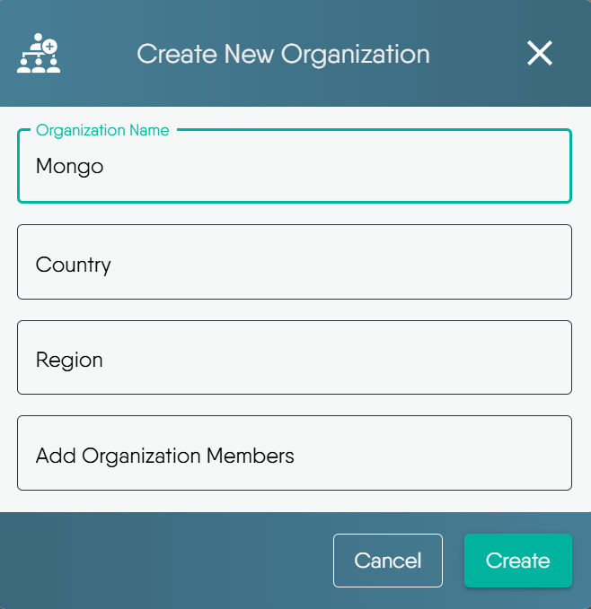
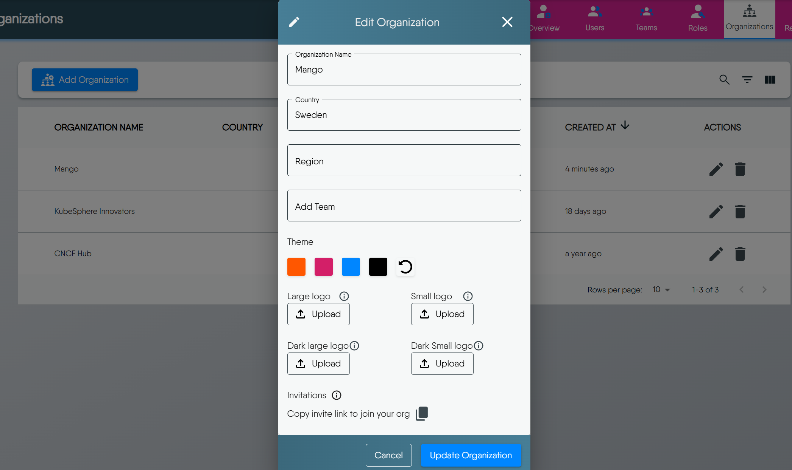
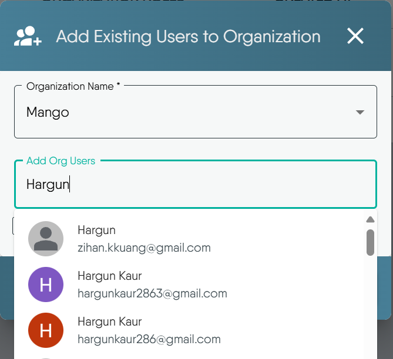
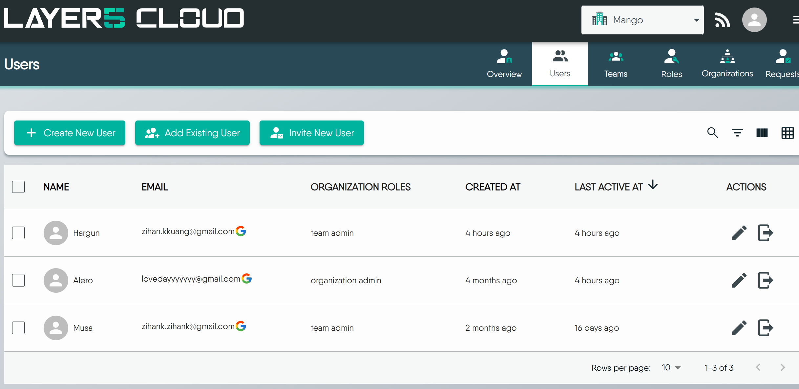
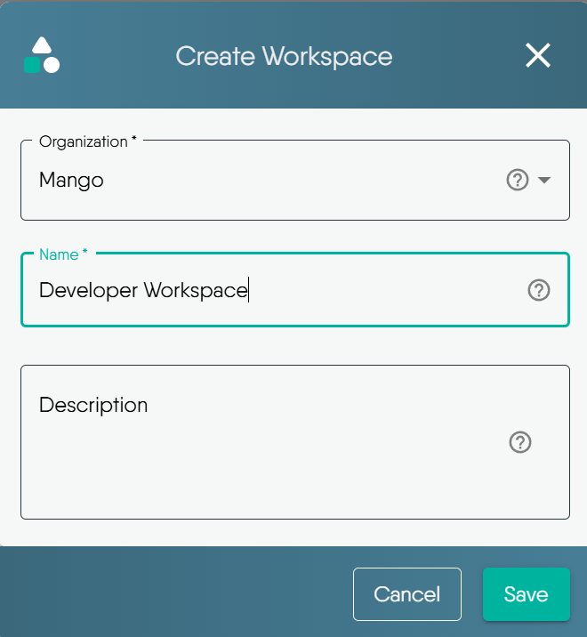
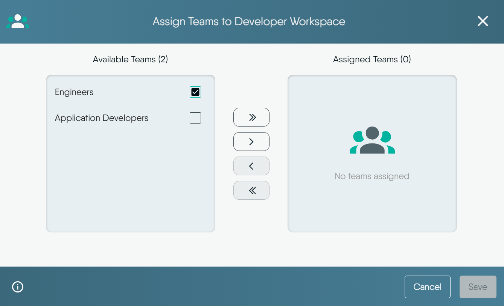
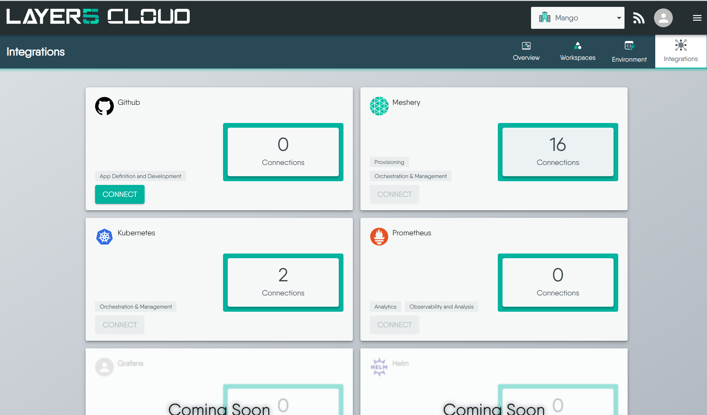

## Introduction

This guide walks through how to effectively organize your Meshery workspace using a real-world scenario. 
Meet Alero, an Engineering Manager at Mango company, and two DevOps engineers, Musa and Hargun. Alero's responsibilities include assigning workspaces, teams, and environments, as well as managing access control for Musa and Hargun. Each engineer leads their own team with distinct responsibilities.

The goal here is to show you how Alero can structure their workspaces to streamline collaboration, maintain robust access control, and optimize workflow deployment across these teams. By following along, you'll learn how to set up a similar structure for your own organization.

## Setting Up Your Organization

### Understanding Organizations
In Layer5 Cloud, an [Organization](https://docs.layer5.io/cloud/identity/organizations/) can house multiple teams, and these teams are where you'll group users. It's through these teams that you'll manage access to specific resources like Workspaces and their contents. Think of the Organization as the top-level boundary that makes this structured collaboration and resource management possible. For our scenario, Alero will start by creating an Organization for her engineering team, laying the groundwork for their work in Meshery.

### How to Create an Organization
1. To create your organization, navigate to [Layer5 Cloud Organizations](https://cloud.layer5.io/identity/organizations) on the Layer5 Cloud dashboard.
2. Click on Add Organizations and Fill in the details for your Organization.

### Editing Your Organization's Details

Once your organization is created, you might need to make changes or retrieve its invitation link.

1.  To edit details, find your organization in the list and click on the **pencil icon** under the "Actions" column.
2.  A modal window will appear, allowing you to modify various settings for your organization.
3.  **Inviting Users with a Link**: Inside this modal, under "Invitations," you'll find an option to **Copy your organization link**. Any user who signs up using this unique link will automatically be added to your organization, simplifying the onboarding process.
4.  After making any necessary changes to the organization's details, click on **Update Organization** to save them.

## Adding Users to Your Organization

With your organization set up, the next step is to bring your team members on board. Alero will now add Musa and Hargun.

### Methods for Adding Users
You have two ways to add users:
-   **Using the Invite Link**: As covered in the "Editing Your Organization's Details" section, you can share a direct invitation link.Learn more about [Invite Link](https://docs.layer5.io/cloud/identity/organizations/org-management/)
-   **Manual Addition via Layer5 Cloud Users**: This method is useful for adding **existing** Layer5 Cloud users or creating **new** accounts directly.

### How to Add Users Manually
1.  Navigate to [Layer5 Cloud Users](https://cloud.layer5.io/identity/users)
2.  In the Users section, you have several options for adding users to your chosen organization:

    -   **Create New User**: This is to create a new user account and email new user with account setup instructions. Optionally, add the new user to your organization with or without assigned roles.
    -   **Add Existing User**: This is to add an existing user to your organization.
    -   **Invite New User**: This option sends an invitation to an email address for someone who does not yet have a Layer5 Cloud account.

3.  To add existing users (like Musa and Hargun):
    -   Click on **Add Existing User**.
    -   In the modal that appears, select the **Organization name** you want to add them to (e.g., Mongo).
    -   Search for the users by name that you wish to add.
    -   Once selected, click **Update Organization** to add them.

To learn more about creating Users, See [Layer5 Users Docs](https://docs.layer5.io/cloud/identity/users/).

## Assigning Roles to Users

Users added to an organization receive a set of [default permissions](https://docs.layer5.io/cloud/identity/users/default-permissions/). However, to grant them specific capabilities, such as managing teams, you'll need to assign them appropriate roles. Alero wants Musa and Hargun to be able to administer their respective teams, so she will assign them the "Team Admin" role.

### How to Assign Roles
1.  Click the **pencil icon** .
2.  In the "Edit User Profile" modal, locate the **Organization Roles** dropdown menu.

3.  Select the desired role from the list (e.g., "team admin").
4.  Click **Save Changes**.

After you have completed assigning roles, your organization's user overview might look similar to the following:

### How to Create Teams

Alero will create two teams, one for Musa's responsibilities and one for Hargun's, and add each of them as members to their respective teams.

1. Navigate to [Layer5 Cloud Teams](https://cloud.layer5.io/identity/teams).
2. Click on Add Team.
3. Enter the details of your new team and select new team members from your organization users.

After creating the teams, they will appear in the Teams list. You can click on a team to see its members.

To learn more about Teams Roles, See [Teams Roles Docs](https://docs.layer5.io/cloud/security/roles/team-roles/).

## Creating a Workspace

With your users organized into teams and assigned appropriate roles, you're ready to set up Workspaces. Workspaces are where the actual work happens – they group designs, environments, and connections for specific projects or purposes.

### How to Create a Workspace
1.  Navigate to [**Workspaces**](https://cloud.layer5.io/spaces/workspaces)
2.  Click on **Create**.
3.  Enter the detail

Your new workspace will be created and will typically appear as an empty container, ready for you to assign environments, teams and resources.

## Assigning a Team to a Workspace

To allow team members to collaborate within a workspace, you need to assign their team(s) to it. Alero will assign the "Engineers Team" to the "Developer Workspace".

### How to Assign a Team
1.  Select the workspace you want to configure,click the "Teams".
2.  You'll typically see two columns: "Available Teams" and "Assigned Teams".
    - From the "Available Teams" list on the left, select the team you wish to assign (e.g., "Engineers").
    - Click the > button to move the selected team to the "Assigned Teams" list on the right.
4.  Click **Save** to confirm the assignment.

Now, members of the assigned team(s) will have access to this workspace according to their roles and permissions. This enables them to view and collaborate on any designs and views that are part of this workspace, facilitating teamwork.

To learn more about Workspace, See [Workspace Docs](https://docs.layer5.io/cloud/spaces/workspaces/).

## Managing Integrations for Teams

Team Members will need certain integrations/Connections to carry out their tasks.

### How to Configure Connections for Teams
1.  Navigate to [**Integrations**](https://cloud.layer5.io/spaces/integrations) in Layer5 Cloud.
2.  Next, configure the connections that a particular team will require to work.

For more detailed instructions, consult dedicated guides for specific integrations (e.g., [Integrating GitHub](https://docs.layer5.io/cloud/getting-started/github-integration/))
