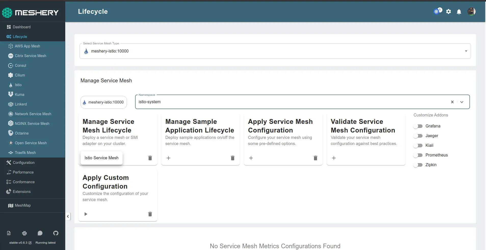

### Setup Istio

Now that we have a Kubernetes cluster and Meshery, we are ready to download and deploy Istio resources.

### Steps

1. [Install Istio](#1)
1. [Verify install](#2)

Optional (manual install of Istio):

1. [Download Istio resources](#1.1)
1. [Setup `istioctl`](#1.2)
1. [Install istio](#1.3)

#### Install Istio

Using Meshery, select `Istio` from the `Lifecycle` menu.

In the Istio management page:

1. Type `istio-system` into the namespace field.
2. Click the (+) icon on the `Install` card and click on `Istio Service Mesh` to install latest version of Istio.

   


3. Click the `Deploy` button on the confirmation modal.

   

#### Alternative:Manual installation
Perform the below steps if the above steps doesn't work for you.


##### Download Istio

You will download and deploy the latest Istio resources on your Kubernetes cluster.

**_Note to Docker Desktop users:_** Please ensure your Docker VM has at least 4GiB of Memory, which is required for all services to run.

On your local machine, execute:

```sh
curl -L https://git.io/getLatestIstio | ISTIO_VERSION=1.7.3 sh -
```

##### Setting up istioctl

On a \*nix system, you can setup `istioctl` by doing the following:

```sh
brew install istioctl
```

Alternatively, change into the Istio package directory and add the `istioctl` client to your PATH environment variable.

```sh
cd istio-*
export PATH=$PWD/bin:$PATH
```

Verify `istioctl` is available:

```sh
istioctl version
```

Check if the cluster is ready for installation:

```sh
istioctl verify-install
```

##### Install Istio

To install Istio with a `demo` profile, execute the below command.

```sh
istioctl install --set profile=demo
```

Alternatively, with Envoy logging enabled:

```sh
istioctl install --set profile=demo --set meshConfig.accessLogFile=/dev/stdout
```

#### Verify instal

In the Istio management page:

1. Click the (+) icon on the `Validate Service Mesh Configuration` card.
1. Select `Verify Installation` to verify the installation of Istio.

##### Alternatively:

Istio is deployed in a separate Kubernetes namespace `istio-system`. To check if Istio is deployed, and also, to see all the pieces that are deployed, execute the following:

```sh
kubectl get all -n istio-system
```


